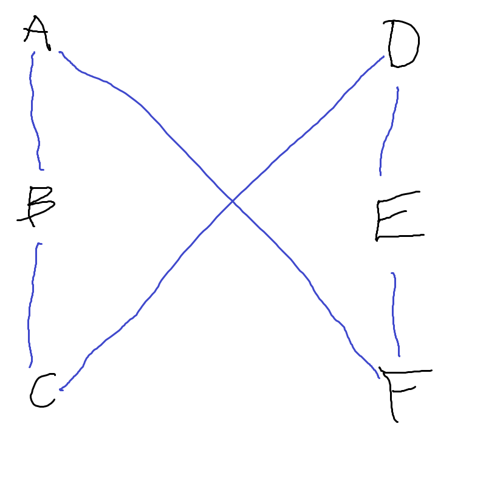
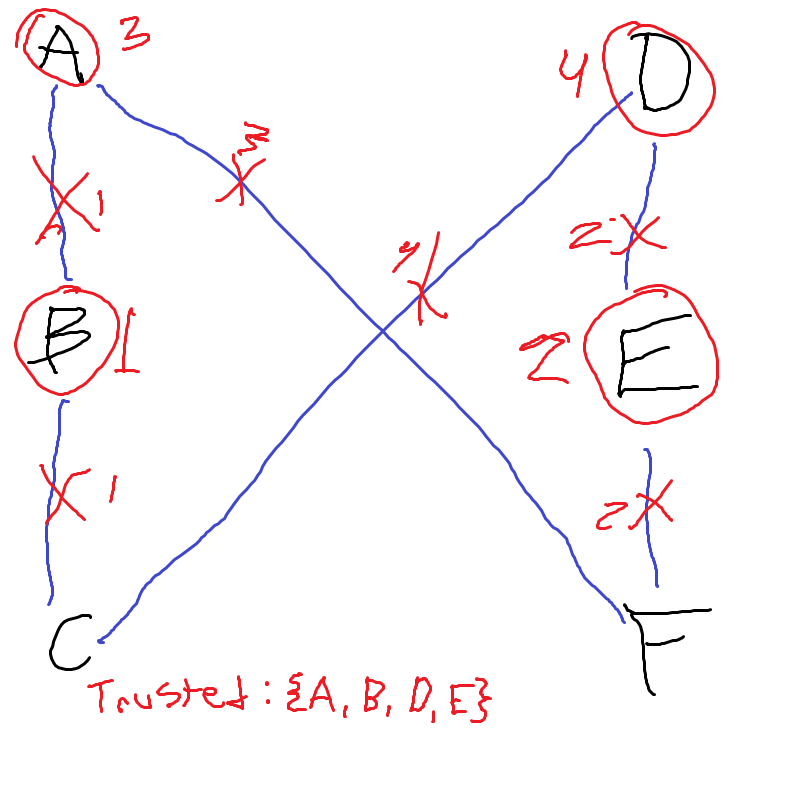
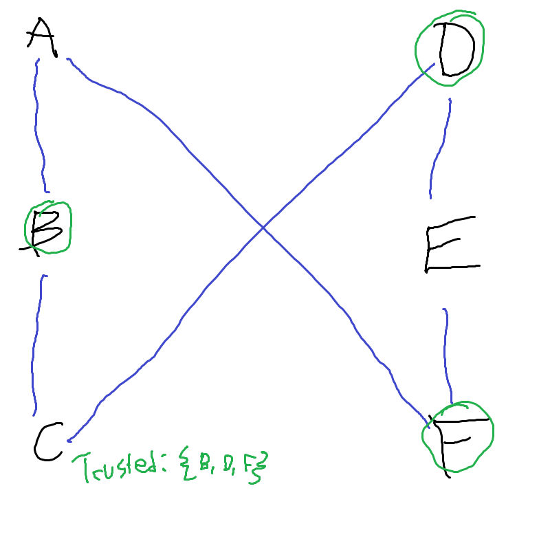

# Professor Smart's Algorithm

## Psudocode
Data Structures Used
* Dictionary mapping a computer to an array of its neighbors
* Array of trusted computers
* An array of tuple edges (eg, (a,b) if a is connected to b)
```text
function smartsAlgorithm (int number_of_computers, array<tuple> connections) {
    computer_to_neighbors = {}
    trusted_computers = []
    edges = []
    for each pair in connections {
        first = pair[0]
        second = pair[1]
        computer_to_neighbors[first].add(second)
        computer_to_neighbors[second].add(first)
        edges.add(pair)
    }
    while edges has elements {
        max_node = element of computer_to_neighbors with longest array
        Trusted.add(max_node)
        for each neighbor in computer_to_neighbors[max_node] {
            edges.remove((max_node, neighbor) or (neighbor, max_node))
            computer_to_neighbors[neighbor].remove(max_node)
        }
        computer_to_neighbors[max_node] = []
    }
    return trusted_computers
}
```

## Time Estimate
Marking how long each section of the code takes
```text
function smartsAlgorithm (int number_of_computers, array<tuple> connections) {
    computer_to_neighbors = {} # O(1)
    trusted_computers = [] # O(1)
    edges = [] # O(1)
    for each pair in connections { # TIME: O(n) because it is going through a set number of connections that is based on the input
        first = pair[0] # O(1)
        second = pair[1] # O(1)
        computer_to_neighbors[first].add(second) # O(1)
        computer_to_neighbors[second].add(first) # O(1)
        edges.add(pair) # O(1)
    }
    while edges has elements { # TIME: O(n^3)
        max_node = element of computer_to_neighbors with longest array # TIME: O(n)
        Trusted.add(max_node) # O(1)
        for each neighbor in computer_to_neighbors[max_node] { # TIME: O(n)
            edges.remove((max_node, neighbor) or (neighbor, max_node)) # O(1)
            computer_to_neighbors[neighbor].remove(max_node) # O(1)
        }
        computer_to_neighbors[max_node] = [] # O(1)
    }
    return trusted_computers # O(1)
}
```
So this algorithm takes $O(n^3)$ time to run, as in worst case it has to go through each edge, of which there can be $n \times n$, and for each edge has to find the node with the most neighbors which takes O(n) time. This leads to the total time being $O(n \times n \times n)$ or $O(n^3)$. The rest only takes $O(n)$ or constant time, so it runs in $O(n^3)$ time.

## Failure Case
This algorithm doesn't always work. One counterexample is as follows. (sorry for my bad handwriting)

Smart's algorithm would do the following.

The steps it takes are as labeled, it first removes point B as all the points have equal connections. Then it removes point E, since it now has a choice between points D, E, and F as they each have 2 connections. After this choice it is left with two sets of pairs, points A and F and points C and D. It then chooses one from each of these pairs, ending with A, B, D, and E as the trusted computers.
By choosing the points B, D, and F as your trusted computers, you can also get a possible solution, that has fewer trusted computers.

This means that Smart's algorithm is not always correct.