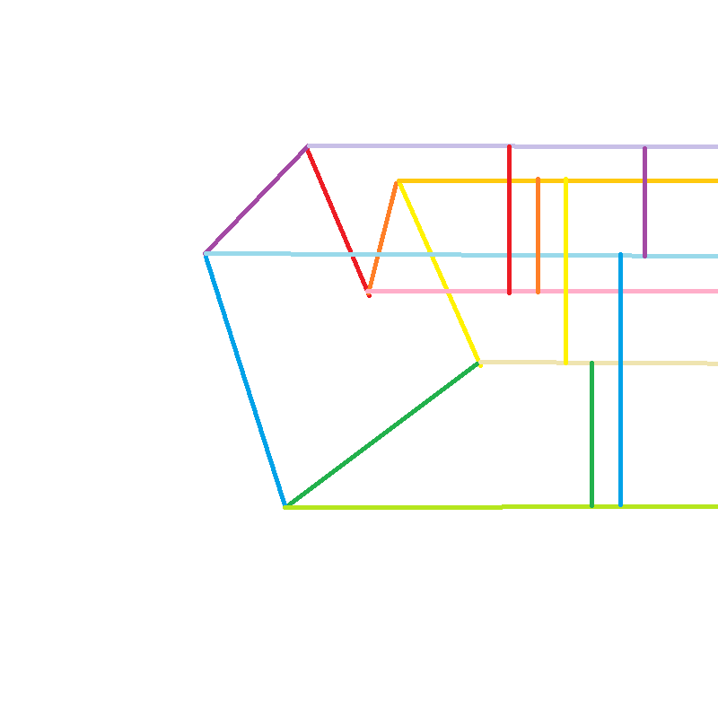
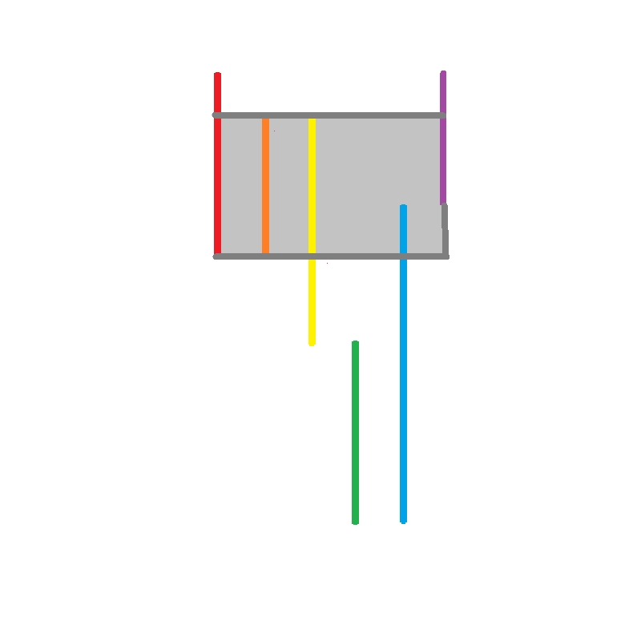

# Horizontal Crossing Problem

## Reasoning

First off, we know that we can ignore the x values of each vertex, since all we care about is their vertical position. We could make the array of points into an array of lines, which could allow us to do this problem in a similar way to the interval scheduling we did in class. We also know that an optimal line will be able to be placed at the end of one of these lines, more specifically, that we could always put the most intersecting line at the right or left side of one of these lines. We know this since the most overlapping area will always be a range from the start of one line that makes it most overlapping, to the end of another (or the same) line, making it no longer the most overlapping area.
For example, if this was the polygon:

Then I would turn the y values of each point into lines:

We would then take the lines and find the most overlapping area:

And we could then put the line at either the top or bottom of the orange segment.
To find the point with the most overlap, we could then turn this list of segments into a list of line starts and line ends, and where they are in the y direction, and sort it by the y position of each event. This would allow us to go through this new list once, and by keeping a tally of how many segments are currently active and the maximum ammount active, find the point where the most are active.
We could simplify this algorithm by simply sorting the input array, then converting the y component directly into start and end points.

## Psudocode

```python
def find_highest_crossings (array):
    events: array<tuple> = [] # In the form (position, type) where type is -1 for an end and +1 for a start
    for i in range(0, array.length):
        y1 = array[i]
        y2 = array[(i+1)%i]
        append (min(y1, y2), 1) to events
        append (max(y1, y2), -1) to events

    merge_sort(events) # Sort by event position (the y position)
    max_simultanious = 0
    max_simultanious_location = 0
    current_simultanious = 0
    for i in range(0, events.length):
        current_simultanious += events[i][1]
        if current_simultanious > max_simultanious:
            max_simultanious = current_simultanious
            max_simultanious_location, = events[i][0]
    return max_simultanious_location;
```

## Proof

When looking for a line that crosses the maximum ammount of lines in a polygon, we can ignore the horizontal position of the lines, and turn the lines into vertical segments. We can then turn those segments into start and end points which represent the y values at which these segments start and end. We know that the only place that the number of overlapping segments can change is at a start or end point. Therefore we can go through each start and end point and find the one where the number of overlapping segments is highest.

## Running Time

### Estimate

The running time is $O(n \log n)$

### Reasoning

The running time estimate is as follows.
```python
def find_highest_crossings (array):
    events: array<tuple> = [] # O(1)
    for i in range(0, array.length): # O(n)
        y1 = array[i] # O(1)
        y2 = array[(i+1)%i] # O(1)
        append (min(y1, y2), 1) to events # O(1)
        append (max(y1, y2), -1) to events # O(1)

    merge_sort(events) # O(n log n)
    max_simultanious = 0 # O(1)
    max_simultanious_location = 0 # O(1)
    current_simultanious = 0 # O(1)
    for i in range(0, events.length): # O(n) since the number of events will be 2x the number of vertices, and O(2n)=O(n)
        current_simultanious += events[i][1] # O(1)
        if current_simultanious > max_simultanious: # O(1)
            max_simultanious = current_simultanious # O(1)
            max_simultanious_location, = events[i][0] # O(1)
    return max_simultanious_location;
```
So our result is $4O(1) + 2O(n) + O(n \log n) = O(n\log n)$ since the longest running time is the merge sort operation which takes $O(n\log n)$ time, and everything else is either constant or $O(n)$ time.