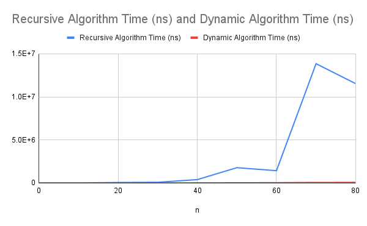

# Algorithm Comparison

## Data

| n   | Recursive Algorithm Time (ns) | Dynamic Algorithm Time (ns) |
| --- | ----------------------------- | --------------------------- |
| 0   | 6600                          | 800                         |
| 5   | 3700                          | 1600                        |
| 10  | 7900                          | 2500                        |
| 20  | 63400                         | 6100                        |
| 30  | 87300                         | 11400                       |
| 40  | 395100                        | 19700                       |
| 50  | 1781300                       | 30900                       |
| 60  | 1432200                       | 40500                       |
| 70  | 13850600                      | 69400                       |
| 80  | 11535600                      | 74100                       |

## Analysis

When running the algorithms to collect data, I made several findings. One of these was that I could not go above around 200 elements before the recursive algorithm took too long to reasonably run, for which reason I decided to keep all my n values below 100. I also found that the dynamic algorithm appears to run in linear time, where the time in nanoseconds is around 1000 times the number of elements for a large array, although for smaller arrays there are higher ratios, possibly due to the overhead of calling the function. The recursive algorithm on the other hand, seems to work in polynomial time, increasing at a rate similar to $n^2$. 